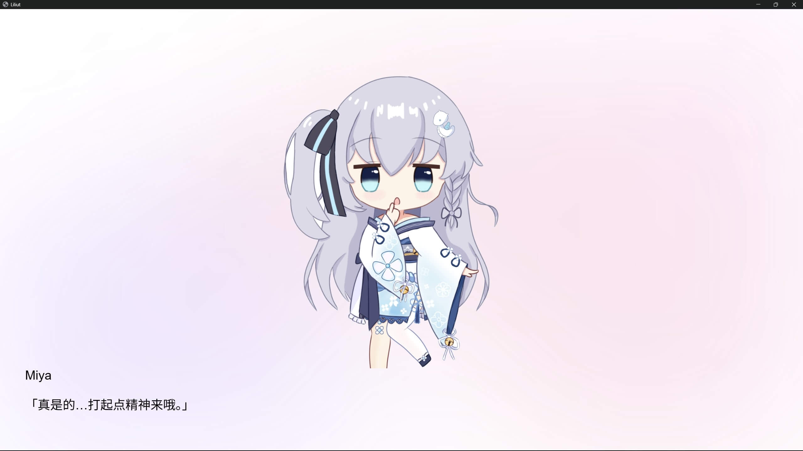

# Liliut

Liliut (Lilium-Typst) is a Visual Novel Engine powered by Astro and Typst.

Liliut (Lilium-Typst)是一款基于 Astro 和 Typst 的视觉小说引擎。

## Demo

You can see the demo of Liliut at [liliut](https://myriad-dreamin.github.io/liliut/).

<p align="center">

</p>

<p align="center">

</p>

## Open in Desktop

Chrome is needed. On Windows:

```Powershell
& chrome.exe --app="https://myriad-dreamin.github.io/liliut/"
```

On Unix:

```bash
chrome --app="https://myriad-dreamin.github.io/liliut/"
```

## 🧞 Commands

All commands are run from the root of the project, from a terminal:

| Command                | Action                                           |
| :--------------------- | :----------------------------------------------- |
| `pnpm install`         | Installs dependencies                            |
| `pnpm dev`             | Starts local dev server at `localhost:4321`      |
| `pnpm build`           | Build your production site to `./dist/`          |
| `pnpm preview`         | Preview your build locally, before deploying     |
| `pnpm astro ...`       | Run CLI commands like `astro add`, `astro check` |
| `pnpm astro -- --help` | Get help using the Astro CLI                     |

## License

The code are licensed under Apache 2.0 unless otherwise specified. All rights of rest content are reserved.
